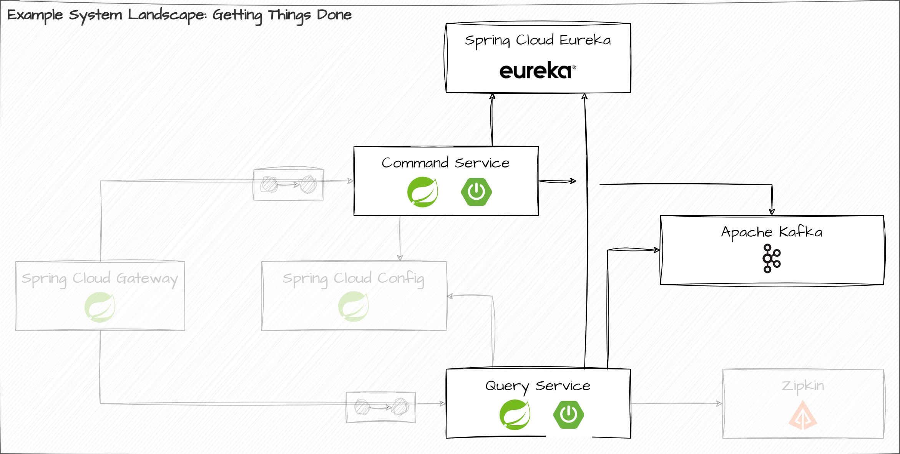

# Lab Assignment

Your task is to implement a Discovery Service using the Spring Cloud component _Spring Cloud Netflix Eureka_ and integrate this Discovery Service with the existing services of our architecture. The resulting system should look like this:



## Task #1: Create a Spring Boot application for the Discovery Service

1. Go to `start.spring.io` and create a new Maven project using the following coordinates:

* Group ID: `workshop.spring.discovery`
* Artifact ID: `gtd-discovery-service` (or choose your own)

2. What dependencies do you need to turn this Spring Boot application into a fully-fledged Spring Cloud Netflix Eureka server? Add the necessary dependencies to the build.

3. Generate the Maven `pom.xml` using the Spring Initialzr. Copy the resulting code into the local checkout of this repository and integrate it with the Maven build (cf. `<modules>` section of the parent POM).

4. Enable the Eureka server component for your Spring Boot application.

5. Configure the Eureka server (cf. `application.yaml`).

6. Launch the discovery service and verify that the service starts up properly. Go to http://localhost:8761/ to open up its dashboard.

## Task #2: Register the Command Service and Query Service with the Discovery Service

With the Eureka server up and running, it is now time to register our application services with it. Before we do so, we need to run the Eureka server as part of our local Docker setup. This means that you need to extend the `build-containers.{bat|sh}` script as well as the `docker-compose.yaml` file.

1. Add the following line to `build-containers.{bat|sh}`:

```shell
docker build -t getting-things-done/eureka/discovery-service ../gtd-discovery-service
```

2. Add the following lines to `docker-compose.yaml`:

```yaml
  discovery-service:
    image: getting-things-done/eureka/discovery-service
    mem_limit: 256m
    ports:
      - "127.0.0.1:8761:8761"
    environment:
      eureka.instance.hostname: discovery-service
```

3. Configure the Command Service such that it is able to register itself with the Eureka server.

4. Configure the Query Service such that it is able to register itself with the Eureka server.

5. Launch the whole setup to verify that everything connects up as expected. Go to http://localhost:8761/ to open up its dashboard and check if both application instances have registered themselves.

6. What happens if you scale the number of instances for a specific application up? What happens if you scale back down? How frequently does the Eureka server detect churn? (wrt. its configuration)

```shell
docker-compose up --scale query-service=2
```

## That's it! You've done great!

You have completed all assignments. If you have any further questions or need clarification, please don't hesitate to reach out to us. We're here to help.